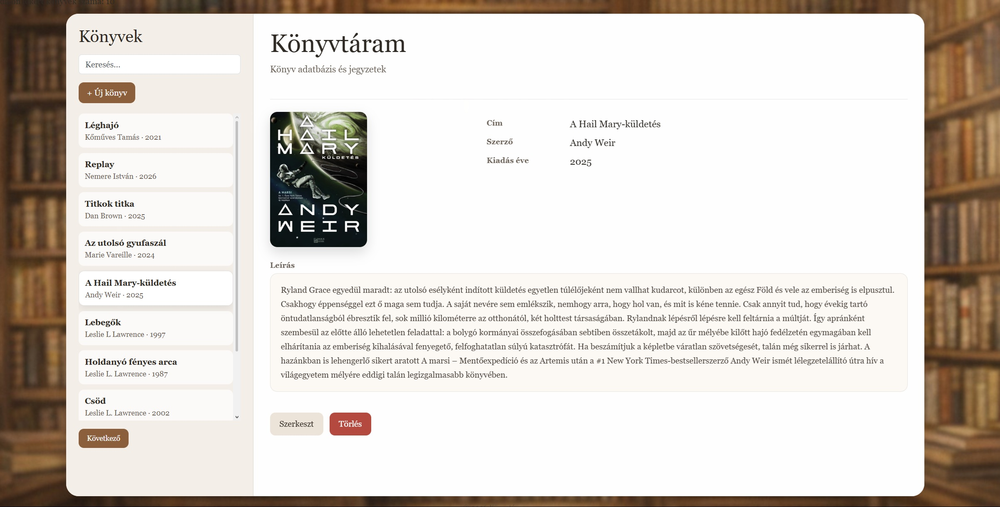
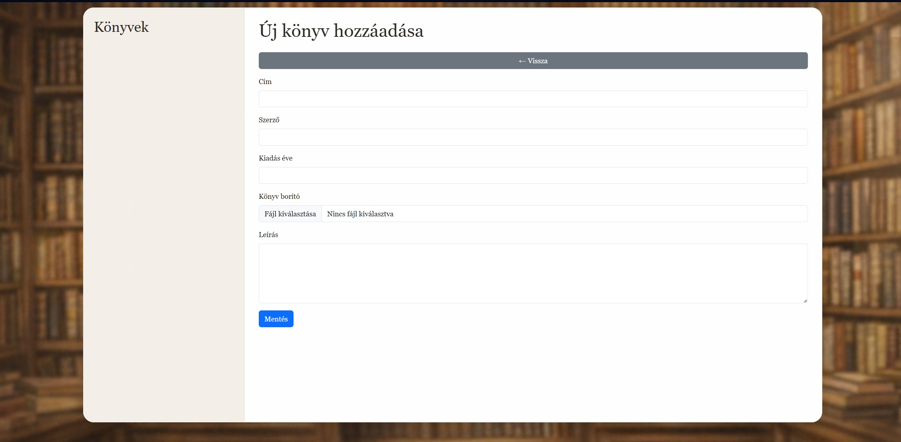
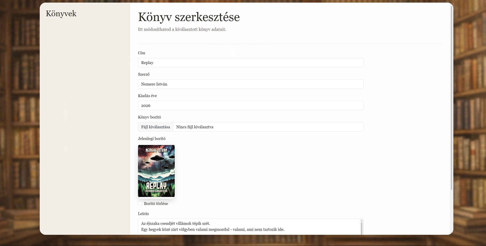

Könyvadatbázis rendszer

Saját fejlesztésű PHP + MySQL alapú webalkalmazás könyvek kezelésére.
A projekt célja egy teljes CRUD rendszer megvalósítása backend és frontend oldalról.

 Funkciók:
- Új könyv hozzáadása
- Könyvek listázása
- Könyv szerkesztése
- Könyv törlése
- Borítókép feltöltés

Használt technológiák:
PHP (backend logika)
MySQL (adatbázis)
Bootstrap (layout)
HTML / CSS / JavaScript

Futtatás (lokálisan):
XAMPP indítása (Apache + MySQL)
Projekt bemásolása a htdocs mappába
phpMyAdmin-ban adatbázis létrehozása
SQL fájl importálása (ha van)
Böngészőben megnyitás:
[http://localhost/bookdb](http://tamasbooks.great-site.net/index.php)

Képernyőképek:

A projekt egy teljes működő CRUD alkalmazást valósít meg.
Bemutatja az adatbázis-kezelést, űrlapfeldolgozást és az alapvető backend működést.

Készítette:
Kőműves Tamás
